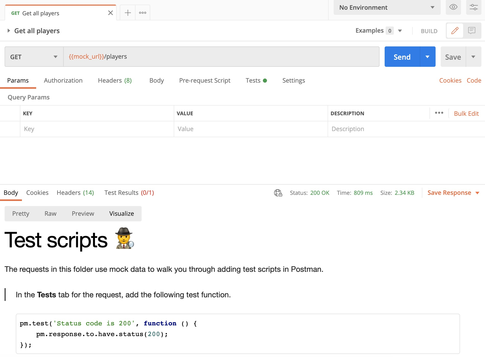

# Postman Classroom Teaching Kit

_This kit is for educators looking to teach Postman in their programs._

Thanks for your interest in teaching Postman in your classroom! 🎓🎒🚀

Here you will find supporting resources you can use to build Postman into your learning experiences. You are welcome to use these resources as they are or to fork and remix them.

## Postman Classroom Template

The Postman Classroom template walks learners through API and Postman fundamentals. Learners can import the template, send the first request, and be guided through next steps by the response data via the Postman visualizer.

A template is a Postman collection that is published online and that you can [import into Postman](https://learning.postman.com/docs/getting-started/importing-templates/). Here's how the classroom template works:

* The template uses an API hosted on [Glitch](https://glitch.com/), and a Postman [mock server](https://learning.postman.com/docs/designing-and-developing-your-api/mocking-data/setting-up-mock/).
* The API / mock endpoints are designed specifically for learning, so the response data includes information about the request, together with next steps.
* The template includes a script for presenting the response information in the Postman [Visualizer](https://learning.postman.com/docs/sending-requests/visualizer/), so that it renders as a tutorial, with text, images, and example code.
* The learner completes the collection by editing request components, and adding new requests.
* Each Postman collection is represented as JSON data, which you can retrieve via a public URL. When they have completed the steps, the learner copies their collection's public link into the final request to retrieve the JSON data. The request runs a test script on the collection JSON to check for completeness. The tests will pass if the learner has completed all of the required collection edits.

The classroom template is in the Postman Student Program workspace–available at a short url:

* [**bit.ly/student-workspace**](http://bit.ly/student-workspace)

_If you plan on using the template in your classroom please try it out in Postman yourself first. Select the __Postman Classroom__ collection in __Collections__ on the left, and click __Fork__ to copy it into your own workspace. Open the first request, send it, and open the Visualize view on the response. The instructions guide you through the steps–but you are also welcome to add your own context or any additional info you feel learners will benefit from._

Please check out the [Postman classroom curriculum](student.md) for pointers on topics. The list is generic but you are welcome to choose topics to suit your own programs and learning contexts. If you'd like to make suggestions on the curriculum or classroom experience [please submit an issue](https://github.com/postmanlabs/templates/issues)!

## Checking Student Progress

If you want to help students complete their student expert collections or check progress, you can ask them to share their collection links using the following steps:

* Select the collection
* Click __Share__
* Click __Get public link__
* Generate or update link (making sure the students update after every time they make a change as it's just a snapshot)
* Copy the link

If the students send you their links you can import their collections into Postman by clicking __Import__ &gt; __Link__. Then you can run the final request `Test collection` to check for completeness.

> If you want to test a batch of collections you can do so using a data file–add each collection link on a new line in a `.csv` file with `your-collection-link-here` on the first line. Import the Student Expert or Classroom collection into your workspace (from [bit.ly/student-workspace](https://bit.ly/student-workspace)). Select the collection and click __Run__, choose the data file, and run–to identify any links that are failing, click the collection run output.

## Postman Classroom Slides

The slide deck is available at a short url—it's in Google Slides but you can download and edit it however you like.

* [**bit.ly/postman-classroom-slides**](http://bit.ly/postman-classroom-slides)

## Postman Support and Community

Please [let the community know](https://community.postman.com/) about your API learning programs!

You can find additional info about all things Postman in the official resources:

* [Learning Center](https://learning.postman.com/)
* [Community Forum](https://community.postman.com/)
* [Postman YouTube channel](https://www.youtube.com/postmanapidevelopment)

If you're using Postman in your classroom you are welcome to apply for access to additional features via the educator's plan. The Postman team will send you a link for access within a couple of weeks when you apply to join the classroom program! 🎉
